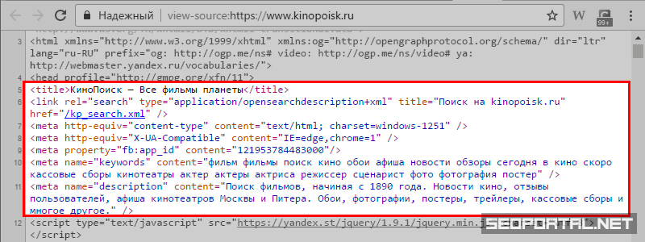
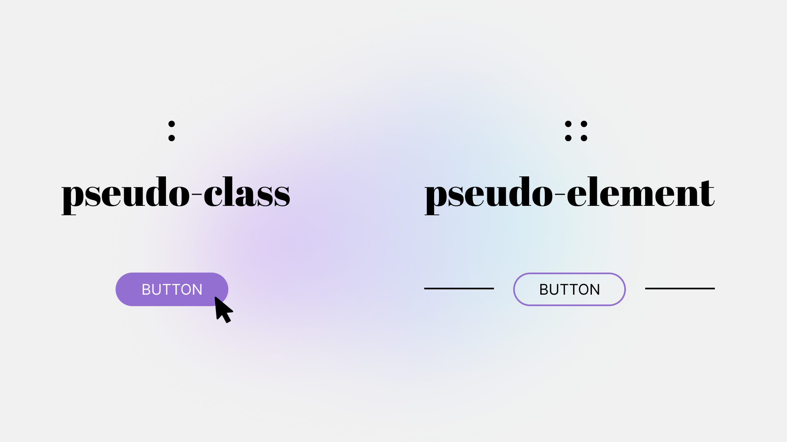
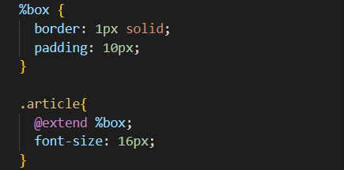
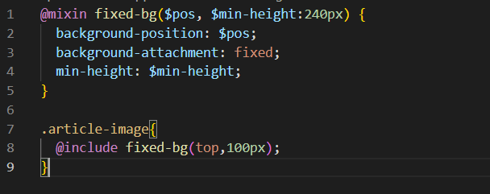
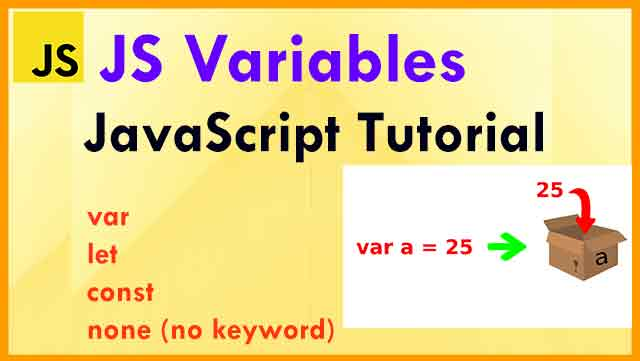
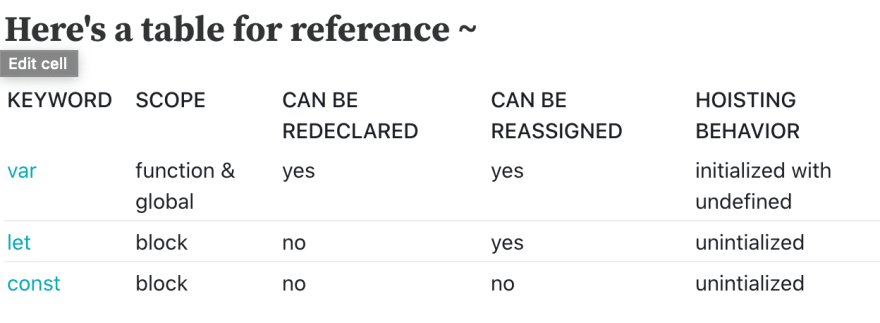
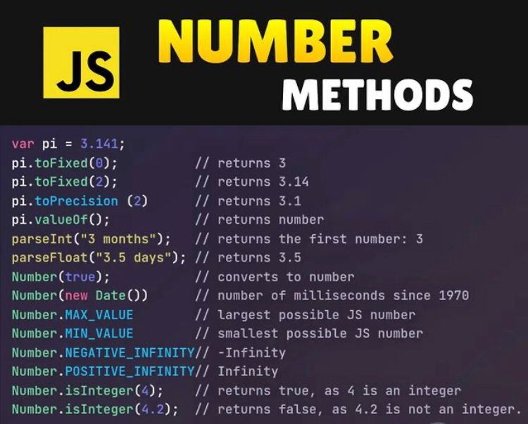
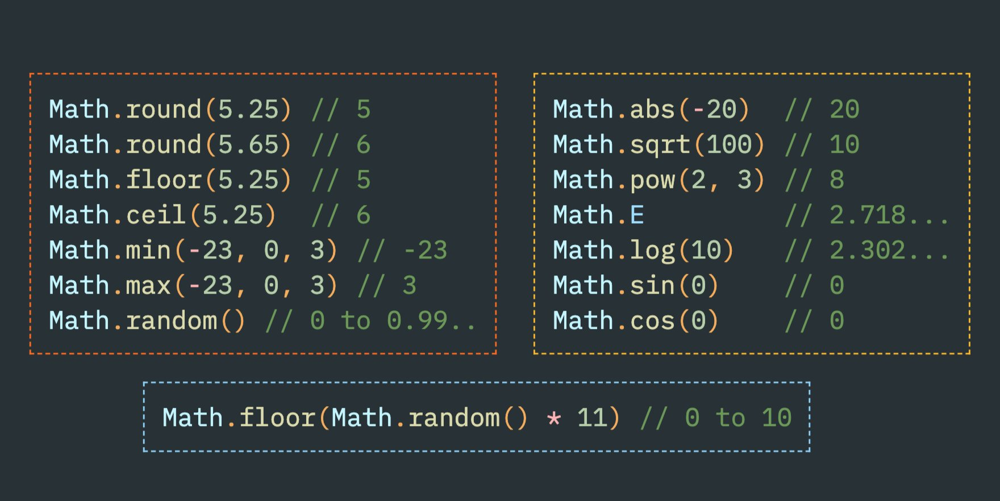
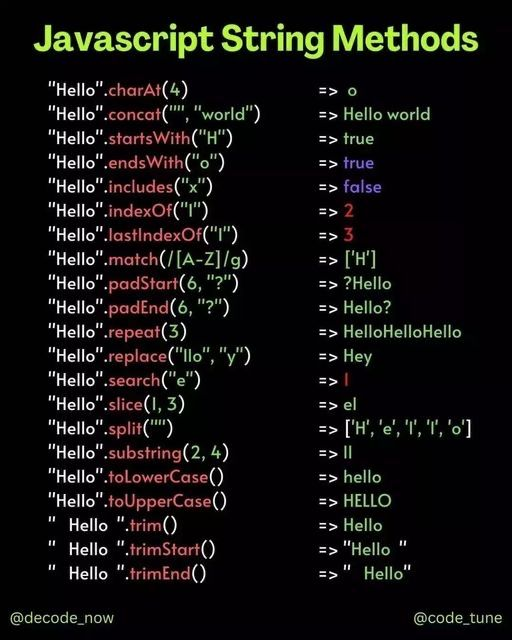
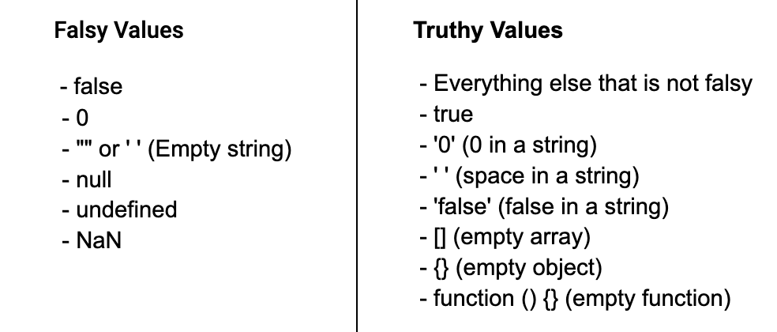

# TECHNICAL INTERVIEW 
1. meta teglar vazifasi ?
2. pesudo class va pseudo element farqi?
3. mixin vs extend farqi ?
4. javascript data types ?
5. variables difference ?
6. Number methods 
7. Math object
8. String methods 
9. Undefined vs null ?
10. truthy , falthy ?
11. conditional operator ?
12. taqqoslash operatorlari 
13. o’zlashtirish operatorlari ? 
14. ??  , &&  , ||**  
16. Dynamic elements ?
17. callstack and heap ?
18. array  ? 
19. function 
20. array methods (simple)
21. pure , impure
22. higher orderd functions
23. spread and rest operator ?
24. filter , map , forEach ?
25. reduce qanday ishlaydi ?
27. method nima ?
28. “use strict” keyword
29.  **.this** keyword 
30. deep copy , shalow copy 
31. Object creation types ?
32. Factory function?
33. Generator function ?
34. IIFE ?
35. Currying function ?
36. Lexical Env 
37. Nodelist , HTMLcollection ?
38. DOM selectors ?
39. DOM ?
40. CSSstyledecloration object ?
41. DOM evenets ?
42. Evenet object ?
43. Browser storages ?
44. SetTimeout , SetInterval ?
46. Dynamic elements ?
47. Event delegation ?
48. Promise 
49. Loops 
50. for of & for in 
51. Object methods 
52. Async , Sync ?

<hr>


### 1. **meta teglar vazifasi ?**
- "Meta teglar" yoki "meta etiketlari", veb-sahifaning HTML-kodi ichida ishlatiladigan tegirlardir. Ular, veb-brauzerlarga va qidiruv mashinlariga sahifaning ma'lumotlari haqida ma'lumot berish uchun foydalaniladi. Quyidagi keng ko'lamli meta etiketlari va ularning vazifalari:

```
<meta charset="UTF-8">  // Sahifaning belgisi to'g'ri ko'rinishini belgilaydi. Odatda, UTF-8 ishlatiladi.

<meta name="viewport" content="width=device-width, initial-scale=1.0"> // Mobil qurilmalarda sahifaning to'g'ri ko'rinishda chiqishini ta'minlaydi.

<meta name="description" content="Sahifa tavsifi"> // Sahifaning qisqa tavsifini o'z ichiga oladi va qidiruv natijalarida ko'rinadigan matnni ta'sir etadi.
```


- Bu etiketlar, veb-sahifaning ko'rinuvchilik va foydalanuvchilar bilan muomala qilishini oshirish, qidiruv mashinalarining sahifani tushuntirishini ta'minlash va ijtimoiy tarmoqlarda ulanilganda ko'rinadigan ma'lumotlarni belgilash maqsadida ishlatiladi.

<hr>

### 2. **pesudo class va pseudo element farqi?**



- Quydagi rasim orqali pesudo class va pseudo element farqini yaqqol ko'rishligimiz mumkun , yani stil berish jarayonida tanalab olgan elamentimizga ( :hover , :activ , :visited ) holatlari aynan psedo calss  va (::after , ::befor, ...) esa pseudo element .
<hr>

### 3. **mixin vs extend farqi ?**



- Extend scss da imkoniyatlaridan biri bo'lib bunda biz bironbir elamentimizga beriladigan qaytalanuvchi stillarni  (%) belgisi orqali extentimizga nom berib yozib olamiz va istalgan joyda extendimizni chaqirib ishlatishlik imkonini beradi , bu bir vaqitnig o'zida ham ishimizni engilashtiradi va codlarimizni kamaytiradi .




- Mixin vazifasi ham extendga o'xshash sintacsistibiroz farqli hudi funcsiyalarga qisman oxhshaib ketadi biz kiritgan qiymatlar ososida bizga stil yozib beradi , surat orqali buni yanada yahshiroq tushunishligimiz mumkun.

<hr>

### 4. **javascript data types ?**


- JavaScripta asli data tayplar 8 ta va ular 2 ga bo'linadi primativ va no primativ , primativ turga faqat ozida bita qiymat saqlay oladigan typlar kiradi ular : string , number , undefiend , null , bool , bigint , symbol . No primativga esa o'zida birqancha qiymatlarni saqlay oladigan tiplar kiradi : Object.

<hr>

### 5. **variables difference ?**



- JavaScript o'zgaruvchilari dasturlashda ma'lumotlarni saqlash va ular bilan ishlash uchun keng foydalaniladigan vositalardan biridir. O'zgaruvchilar yordamida ma'lumotlarni saqlash, qayta ishlatish, tuzatish va dastur boshqaruvini osonlashtiradi.

1. - var - globol scob hisoblanadi , qayta qiymat tayinlashlik imkoni mavjud va va qayta elon qilishlik ham .

2. - let - bloc scop , qayta qimatlashlik imkoni mavjud va vardan yana bir farqi qayta elon qilinmaydi yani letta birmarta elon qilingan ozgaruvchi nomini yana shu nom bilan elon qilinmaydi 
3. - const - bloc scop , qayta qiymat tayinlanmaydi va qayta elon qilinmaydiham , bir so'z bilan aytganda o'zgarmas o'zgaruvchilarni const da elon qilinadi .



<hr>

### 6. **Number methods**




- JavaScript-da Number obyekti ichidagi bir nechta methodlar mavjud. Bu methodlar sonlar (numbers) bilan ishlashda yordam bermoqda. Quyidagi, ba'zi Number obyektining metodlari:

 1. - toFixed(): Belirlangan qanday son bo'lishi kerakligini aniqlash uchun ishlatiladi. Natijada bu sonning desimal (qoldiq) qismi qanday ko'rsatilayotganini bildiradi.

 Misol:

```
let son = 3.14159;
let yangiSon = son.toFixed(2);
console.log(yangiSon);  // 3.14
```


2. - toString(): Sonni matn ko'rinishiga o'tkazish uchun ishlatiladi.

Misol:

```
let son = 42;
let sonMatn = son.toString();
console.log(sonMatn);  // "42"
```

 3. - toPrecision(): Sonning belirlangan miqdorda bo'lishini taqdim etadi.

Misol:

```
let son = 1234.567;
let yangiSon = son.toPrecision(4);
console.log(yangiSon);  // 1234
```

4. - isNaN(): Qiymatning son bo'lmaganligini (Not a Number) tekshiradi.

Misol:

```
let qiymat1 = 42;
let qiymat2 = "salom";

console.log(isNaN(qiymat1));  // false
console.log(isNaN(qiymat2));  // true
```

5. - isFinite(): Qiymatning cheklanib bo'lishini (finite) tekshiradi.

Misol:

```
let son1 = 42;
let son2 = Infinity;

console.log(isFinite(son1));  // true
console.log(isFinite(son2));  // false
```

<hr>

### 7. **Math object**



- Math.abs  -> absalyut qiyamt chiqarishlik uchun
- Math.fool -> kichik tamonga yahlitlash M: 12.4 -> 12 , 21.8 -> 21 
- Math.ceele -> katta tamonga yahlitlash M: 12.6 -> 13 , 32.2 -> 33
- Math.round -> rost yahlitlash M: 12.7 -> 13 , 23.4 -> 23
- Math.max/min -> sonlar orasidan eng kattasini va eng kichigini olishlik uchun .
- Math.pow -> songa daraja tayinlashlik M: (2,3)->2^3-> == 8
- Math.sqrt -> ildizdan chiqarish M: kiritgan sonimiz 25 u ildizdan chiqan holatida 5 .
- Math.trunc -> kiritilgan sonnio butun qismini olib beraddi .
- Math.random -> sonlarni random qilib beradi har refresh qilinganda , defoltni holati 0 va 1 oraligida bo'ladi.

<hr>

### 8. **String methods**



- **String length:** Matn uzunligini qaytaradi.

<p>M :</p>

```
var str = "Hello";
console.log(str.length); // 5

```

- **String charAt():** Berilgan indeksdagi belgini qaytaradi.

<p>M :</p>

```
var str = "Hello";
console.log(str.charAt(1)); // "e"

```

- **String charCodeAt():** Berilgan indeksdagi belgining Unicode qiymatini qaytaradi.

<p>M :</p>

```
var str = "Hello";
console.log(str.charCodeAt(1)); // 101

```

-  **String at():** JavaScript tilida yo'q. CharAt() metodini ishlatish mumkin.

- **String [ ]:** Matndagi belgi indeks orqali qaytariladi.

<p>M :</p>

```
var str = "Hello";
console.log(str[1]); // "e"
```

- **String slice():** Berilgan indekslar orasidagi qismni kesib olish.

<p>M :</p>

```
var str = "Hello, World!";
console.log(str.slice(7, 12)); // "World"
```

-  **String substring():** Berilgan indekslar orasidagi qismni kesib olish (slice bilan bir xil, lekin manfiy indekslar bilan ishlaydi).

<p>M :</p>

```
var str = "Hello, World!";
console.log(str.substring(7, 12)); // "World"
```

- **String substr():** Berilgan indeksdan boshlab belgilangan uzunlikdagi qismni kesib olish. 
<p>M :</p>

```
var str = "Hello, World!";
console.log(str.substr(7, 5)); // "World"
```

- **String toUpperCase():** Matndagi harlarni katta qiladi.
<p>M :</p>

```
var str = "hello";
console.log(str.toUpperCase()); // "HELLO"
```

- **String toLowerCase():** Matndagi harlarni kichik qiladi.
<p>M :</p>

```
var str = "HELLO";
console.log(str.toLowerCase()); // "hello"
```
-  **String concat():** Matnlarni birlashtiradi.
<p>M :</p>

```
var str1 = "Hello";
var str2 = ", World!";
console.log(str1.concat(str2)); // "Hello, World!"
```
- **String trim():** Matndan bosh va oxirgi bo'shliklarni olib tashlaydi.
<p>M :</p>

```
var str = "   Hello, World!   ";
console.log(str.trim()); // "Hello, World!"
```

- **String trimStart():** Matndan bosh bo'shliklarni olib tashlaydi.
<p>M :</p>

```
var str = "   Hello, World!   ";
console.log(str.trimStart()); // "Hello, World!   "
```
- **String trimEnd():** Matndan oxirgi bo'shliklarni olib tashlaydi.
<p>M :</p>

```
var str = "   Hello, World!   ";
console.log(str.trimEnd()); // "   Hello, World!"
```
- **String padStart():** Matni berilgan uzunlikka yettirish uchun boshqa belgi bilan to'ldiradi.
<p>M :</p>

```var str = "5";
console.log(str.padStart(3, "0")); // "005"
```
- **String padEnd():** Matni berilgan uzunlikka yettirish uchun boshqa belgi bilan oxirgi qismini to'ldiradi.
<p>M :</p>

```
var str = "5";
console.log(str.padEnd(3, "0")); // "500"
```
- **String repeat():** Matnni berilgan miqdorda takrorlaydi.
<p>M :</p>

```
var str = "Hello";
console.log(str.repeat(3)); // "HelloHelloHello"
```
- **String replace():** Matndagi bir nechta belgilarni boshqa belgilar bilan almashtiradi.
<p>M :</p>

```
var str = "Hello, World!";
console.log(str.replace("World", "Universe")); // "Hello, Universe!"
```
- **String replaceAll():** Matndagi barcha belgilarni boshqa belgilar bilan almashtiradi (ES2021dan boshlab).
<p>M :</p>

```
var str = "Hello, World!";
console.log(str.replaceAll("l", "X")); // HeXXo, WorXd!
```
- **String split():** Matnni belgilarga ko'ra kesib oladi va massivga o'zlashtiradi.
<p>M :</p>

```
var str = "Hello, World!";
console.log(str.split(", ")); // ["Hello", "World!"]
```

<hr>

### 9. **Undefined vs null**


- biz qanchonki ozgaruvchi elon qilsagu umga qiymat bermasak bu undefined bo'ladi agar unig bo'sh ekanligini aytsak yanig null qiyamat bersak u null bo'lasdi rasimda yaqol ko'rishligimiz mumkun .

M:
```
let titl;
console.log(titl) // => undefined

let titl = null;
console.log(titl) // => null
```

### 10. **truthy , falthy**



- Folthy ( 0 , folse , "" , null , undefined , Nan , 0n )
- Truth ( 1 , 1234 , 34343523n , "o" , '  ' , "folse" , true , infinit , -infinit , {} , [] , ...............)

