# TECHNICAL INTERVIEW 
1. meta teglar vazifasi ?
2. pesudo class va pseudo element farqi?
3. mixin vs extend farqi ?
4. javascript data types ?
5. variables difference ?
6. Number methods 
7. Math object
8. String methods 
9. Undefined vs null ?
10. truthy , falthy ?
12. taqqoslash operatorlari 
11. conditional operator ?
13. o’zlashtirish operatorlari ? 
14. ??  , &&  , ||   
16. Dynamic elements ?
17. callstack and heap ?
18. array  ? 
19. function 
20. array methods (simple)
21. pure , impure
22. higher orderd functions
23. spread and rest operator ?
24. filter , map , forEach ?
25. reduce qanday ishlaydi ?
27. method nima ?
28. “use strict” keyword
29.  **.this** keyword 
30. deep copy , shalow copy 
31. Object creation types ?
32. Factory function?!!
33. Generator function ?
34. IIFE ?
35. Currying function ?
36. Lexical Env 
37. Nodelist , HTMLcollection ?
38. DOM selectors ?
39. DOM ?
40. CSSstyledecloration object ?
41. DOM evenets ?
42. Evenet object ?
43. Browser storages ?
44. SetTimeout , SetInterval ?
46. Dynamic elements ?
47. Event delegation ?
48. Promise 
49. Loops 
50. for of & for in 
51. Object methods 
52. Async , Sync ?

<hr>


### 1. **meta teglar vazifasi ?**
- "Meta teglar" yoki "meta etiketlari", veb-sahifaning HTML-kodi ichida ishlatiladigan tegirlardir. Ular, veb-brauzerlarga va qidiruv mashinlariga sahifaning ma'lumotlari haqida ma'lumot berish uchun foydalaniladi. Quyidagi keng ko'lamli meta etiketlari va ularning vazifalari:

```
<meta charset="UTF-8">  // Sahifaning belgisi to'g'ri ko'rinishini belgilaydi. Odatda, UTF-8 ishlatiladi.

<meta name="viewport" content="width=device-width, initial-scale=1.0"> // Mobil qurilmalarda sahifaning to'g'ri ko'rinishda chiqishini ta'minlaydi.

<meta name="description" content="Sahifa tavsifi"> // Sahifaning qisqa tavsifini o'z ichiga oladi va qidiruv natijalarida ko'rinadigan matnni ta'sir etadi.
```
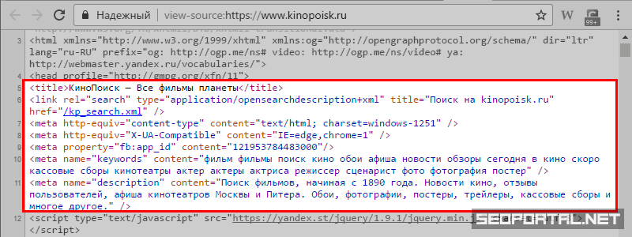

- Bu etiketlar, veb-sahifaning ko'rinuvchilik va foydalanuvchilar bilan muomala qilishini oshirish, qidiruv mashinalarining sahifani tushuntirishini ta'minlash va ijtimoiy tarmoqlarda ulanilganda ko'rinadigan ma'lumotlarni belgilash maqsadida ishlatiladi.

<hr>

### 2. **pesudo class va pseudo element farqi?**

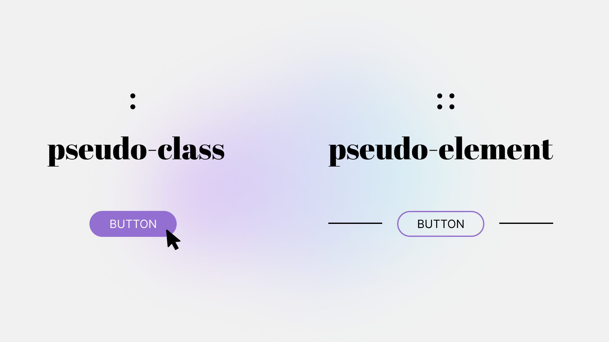

- Quydagi rasim orqali pesudo class va pseudo element farqini yaqqol ko'rishligimiz mumkun , yani stil berish jarayonida tanalab olgan elamentimizga ( :hover , :activ , :visited ) holatlari aynan psedo calss  va (::after , ::befor, ...) esa pseudo element .
<hr>

### 3. **mixin vs extend farqi ?**

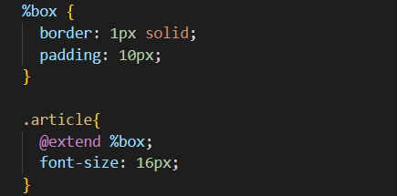

- Extend scss da imkoniyatlaridan biri bo'lib bunda biz bironbir elamentimizga beriladigan qaytalanuvchi stillarni  (%) belgisi orqali extentimizga nom berib yozib olamiz va istalgan joyda extendimizni chaqirib ishlatishlik imkonini beradi , bu bir vaqitnig o'zida ham ishimizni engilashtiradi va codlarimizni kamaytiradi .


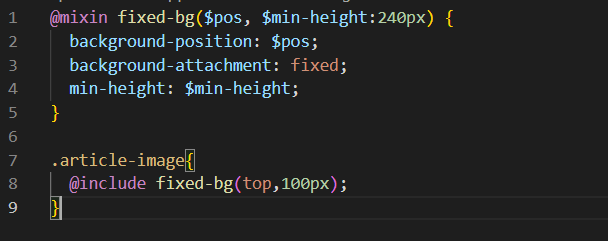

- Mixin vazifasi ham extendga o'xshash sintacsistibiroz farqli hudi funcsiyalarga qisman oxhshaib ketadi biz kiritgan qiymatlar ososida bizga stil yozib beradi , surat orqali buni yanada yahshiroq tushunishligimiz mumkun.

<hr>

### 4. **javascript data types ?**

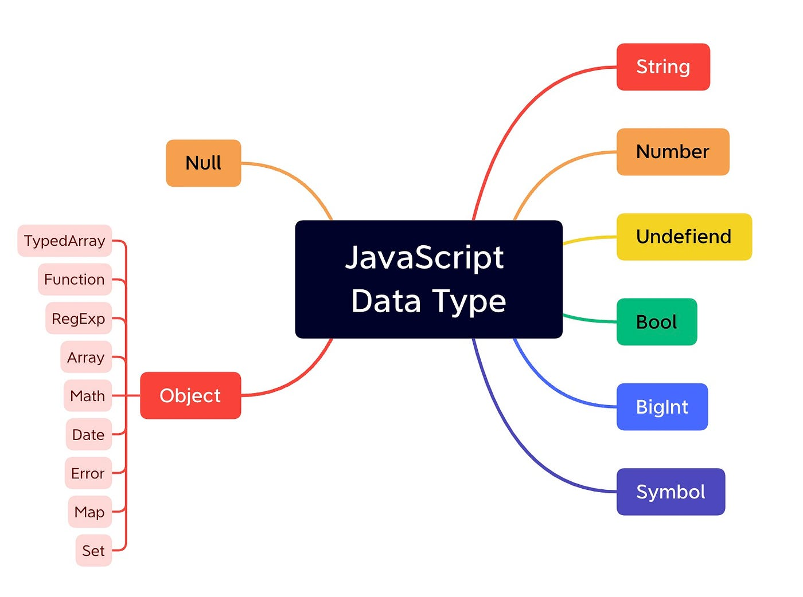

- JavaScripta asli data tayplar 8 ta va ular 2 ga bo'linadi primativ va no primativ , primativ turga faqat ozida bita qiymat saqlay oladigan typlar kiradi ular : string , number , undefiend , null , bool , bigint , symbol . No primativga esa o'zida birqancha qiymatlarni saqlay oladigan tiplar kiradi : Object.

<hr>

### 5. **variables difference ?**

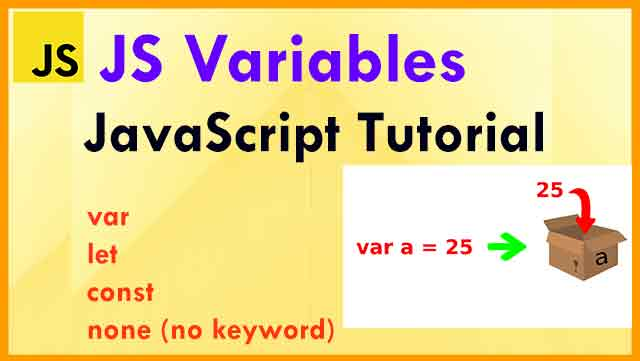

- JavaScript o'zgaruvchilari dasturlashda ma'lumotlarni saqlash va ular bilan ishlash uchun keng foydalaniladigan vositalardan biridir. O'zgaruvchilar yordamida ma'lumotlarni saqlash, qayta ishlatish, tuzatish va dastur boshqaruvini osonlashtiradi.

1. - var - globol scob hisoblanadi , qayta qiymat tayinlashlik imkoni mavjud va va qayta elon qilishlik ham .

2. - let - bloc scop , qayta qimatlashlik imkoni mavjud va vardan yana bir farqi qayta elon qilinmaydi yani letta birmarta elon qilingan ozgaruvchi nomini yana shu nom bilan elon qilinmaydi 
3. - const - bloc scop , qayta qiymat tayinlanmaydi va qayta elon qilinmaydiham , bir so'z bilan aytganda o'zgarmas o'zgaruvchilarni const da elon qilinadi .


<hr>

### 6. **Number methods**

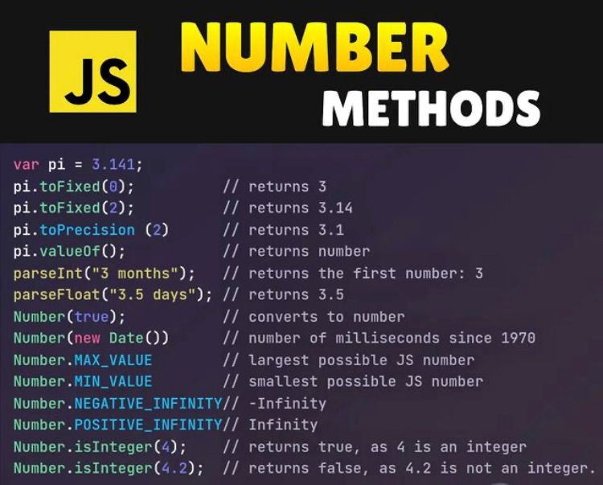


- JavaScript-da Number obyekti ichidagi bir nechta methodlar mavjud. Bu methodlar sonlar (numbers) bilan ishlashda yordam bermoqda. Quyidagi, ba'zi Number obyektining metodlari:

 1. - toFixed(): Belirlangan qanday son bo'lishi kerakligini aniqlash uchun ishlatiladi. Natijada bu sonning desimal (qoldiq) qismi qanday ko'rsatilayotganini bildiradi.

 Misol:

```
let son = 3.14159;
let yangiSon = son.toFixed(2);
console.log(yangiSon);  // 3.14
```


2. - toString(): Sonni matn ko'rinishiga o'tkazish uchun ishlatiladi.

Misol:

```
let son = 42;
let sonMatn = son.toString();
console.log(sonMatn);  // "42"
```

 3. - toPrecision(): Sonning belirlangan miqdorda bo'lishini taqdim etadi.

Misol:

```
let son = 1234.567;
let yangiSon = son.toPrecision(4);
console.log(yangiSon);  // 1234
```

4. - isNaN(): Qiymatning son bo'lmaganligini (Not a Number) tekshiradi.

Misol:

```
let qiymat1 = 42;
let qiymat2 = "salom";

console.log(isNaN(qiymat1));  // false
console.log(isNaN(qiymat2));  // true
```

5. - isFinite(): Qiymatning cheklanib bo'lishini (finite) tekshiradi.

Misol:

```
let son1 = 42;
let son2 = Infinity;

console.log(isFinite(son1));  // true
console.log(isFinite(son2));  // false
```

<hr>

### 7. **Math object**

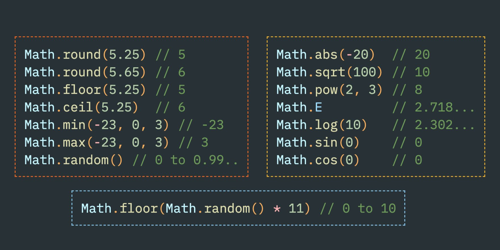

- Math.abs  -> absalyut qiyamt chiqarishlik uchun
- Math.fool -> kichik tamonga yahlitlash M: 12.4 -> 12 , 21.8 -> 21 
- Math.ceele -> katta tamonga yahlitlash M: 12.6 -> 13 , 32.2 -> 33
- Math.round -> rost yahlitlash M: 12.7 -> 13 , 23.4 -> 23
- Math.max/min -> sonlar orasidan eng kattasini va eng kichigini olishlik uchun .
- Math.pow -> songa daraja tayinlashlik M: (2,3)->2^3-> == 8
- Math.sqrt -> ildizdan chiqarish M: kiritgan sonimiz 25 u ildizdan chiqan holatida 5 .
- Math.trunc -> kiritilgan sonnio butun qismini olib beraddi .
- Math.random -> sonlarni random qilib beradi har refresh qilinganda , defoltni holati 0 va 1 oraligida bo'ladi.

<hr>

### 8. **String methods**

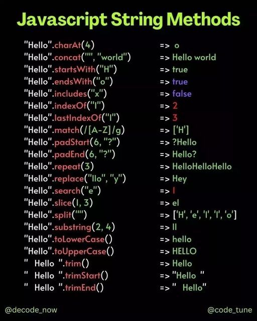

- **String length:** Matn uzunligini qaytaradi.

<p>M :</p>

```
var str = "Hello";
console.log(str.length); // 5

```

- **String charAt():** Berilgan indeksdagi belgini qaytaradi.

<p>M :</p>

```
var str = "Hello";
console.log(str.charAt(1)); // "e"

```

- **String charCodeAt():** Berilgan indeksdagi belgining Unicode qiymatini qaytaradi.

<p>M :</p>

```
var str = "Hello";
console.log(str.charCodeAt(1)); // 101

```

-  **String at():** JavaScript tilida yo'q. CharAt() metodini ishlatish mumkin.

- **String [ ]:** Matndagi belgi indeks orqali qaytariladi.

<p>M :</p>

```
var str = "Hello";
console.log(str[1]); // "e"
```

- **String slice():** Berilgan indekslar orasidagi qismni kesib olish.

<p>M :</p>

```
var str = "Hello, World!";
console.log(str.slice(7, 12)); // "World"
```

-  **String substring():** Berilgan indekslar orasidagi qismni kesib olish (slice bilan bir xil, lekin manfiy indekslar bilan ishlaydi).

<p>M :</p>

```
var str = "Hello, World!";
console.log(str.substring(7, 12)); // "World"
```

- **String substr():** Berilgan indeksdan boshlab belgilangan uzunlikdagi qismni kesib olish. 
<p>M :</p>

```
var str = "Hello, World!";
console.log(str.substr(7, 5)); // "World"
```

- **String toUpperCase():** Matndagi harlarni katta qiladi.
<p>M :</p>

```
var str = "hello";
console.log(str.toUpperCase()); // "HELLO"
```

- **String toLowerCase():** Matndagi harlarni kichik qiladi.
<p>M :</p>

```
var str = "HELLO";
console.log(str.toLowerCase()); // "hello"
```
-  **String concat():** Matnlarni birlashtiradi.
<p>M :</p>

```
var str1 = "Hello";
var str2 = ", World!";
console.log(str1.concat(str2)); // "Hello, World!"
```
- **String trim():** Matndan bosh va oxirgi bo'shliklarni olib tashlaydi.
<p>M :</p>

```
var str = "   Hello, World!   ";
console.log(str.trim()); // "Hello, World!"
```

- **String trimStart():** Matndan bosh bo'shliklarni olib tashlaydi.
<p>M :</p>

```
var str = "   Hello, World!   ";
console.log(str.trimStart()); // "Hello, World!   "
```
- **String trimEnd():** Matndan oxirgi bo'shliklarni olib tashlaydi.
<p>M :</p>

```
var str = "   Hello, World!   ";
console.log(str.trimEnd()); // "   Hello, World!"
```
- **String padStart():** Matni berilgan uzunlikka yettirish uchun boshqa belgi bilan to'ldiradi.
<p>M :</p>

```var str = "5";
console.log(str.padStart(3, "0")); // "005"
```
- **String padEnd():** Matni berilgan uzunlikka yettirish uchun boshqa belgi bilan oxirgi qismini to'ldiradi.
<p>M :</p>

```
var str = "5";
console.log(str.padEnd(3, "0")); // "500"
```
- **String repeat():** Matnni berilgan miqdorda takrorlaydi.
<p>M :</p>

```
var str = "Hello";
console.log(str.repeat(3)); // "HelloHelloHello"
```
- **String replace():** Matndagi bir nechta belgilarni boshqa belgilar bilan almashtiradi.
<p>M :</p>

```
var str = "Hello, World!";
console.log(str.replace("World", "Universe")); // "Hello, Universe!"
```
- **String replaceAll():** Matndagi barcha belgilarni boshqa belgilar bilan almashtiradi (ES2021dan boshlab).
<p>M :</p>

```
var str = "Hello, World!";
console.log(str.replaceAll("l", "X")); // HeXXo, WorXd!
```
- **String split():** Matnni belgilarga ko'ra kesib oladi va massivga o'zlashtiradi.
<p>M :</p>

```
var str = "Hello, World!";
console.log(str.split(", ")); // ["Hello", "World!"]
```

<hr>

### 9. **Undefined vs null**

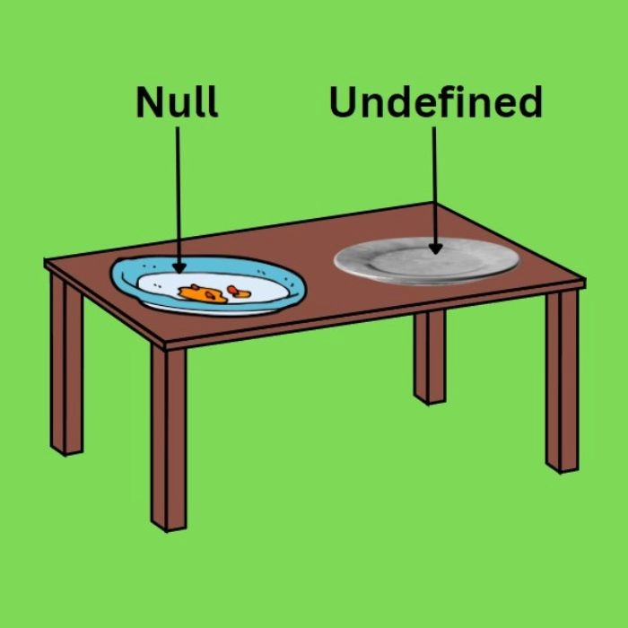

- biz qanchonki ozgaruvchi elon qilsagu umga qiymat bermasak bu undefined bo'ladi agar unig bo'sh ekanligini aytsak yanig null qiyamat bersak u null bo'lasdi rasimda yaqol ko'rishligimiz mumkun .

M:
```
let titl;
console.log(titl) // => undefined

let titl = null;
console.log(titl) // => null
```

### 10. **truthy , falthy**

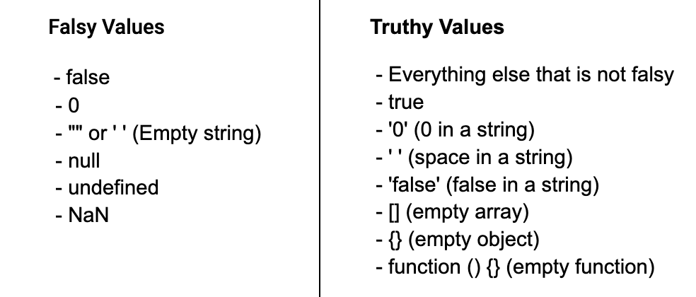

- Folthy ( 0 , folse , "" , null , undefined , Nan , 0n )
- Truth ( 1 , 1234 , 34343523n , "o" , '  ' , "folse" , true , infinit , -infinit , {} , [] , ...............)

<hr>

### 11. **conditional operator** 
 
- if else , else if 
- switch case 
 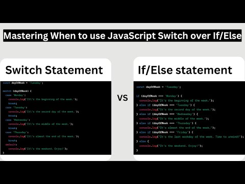

- ternary operator "('..'? ".." : "..")"
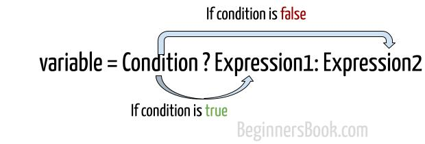

- nalish operator "null || undefind ?? "Yes";
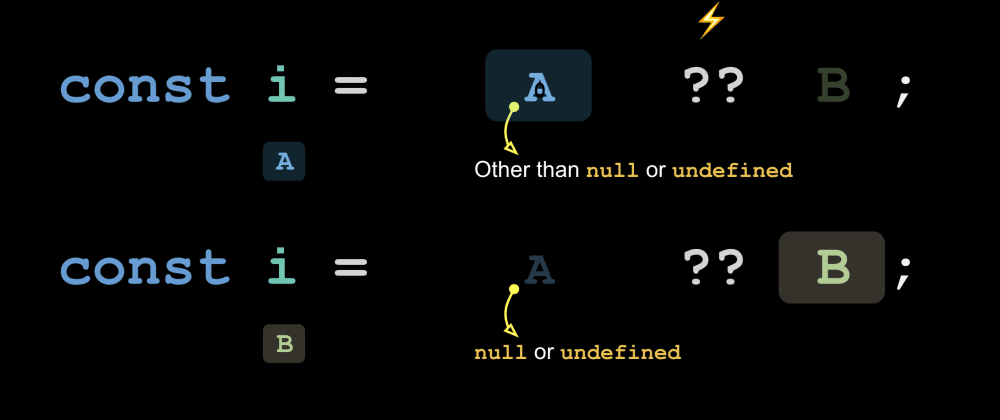

<hr>

### 12. **taqqoslash operatorlari**

- ==, === , <= , >= , !== , != 

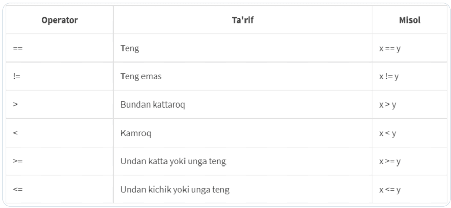

<hr>

### 13. **o’zlashtirish operatorlari**

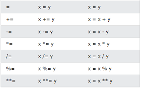

<hr>

### 14. **!  , &&  , ||**

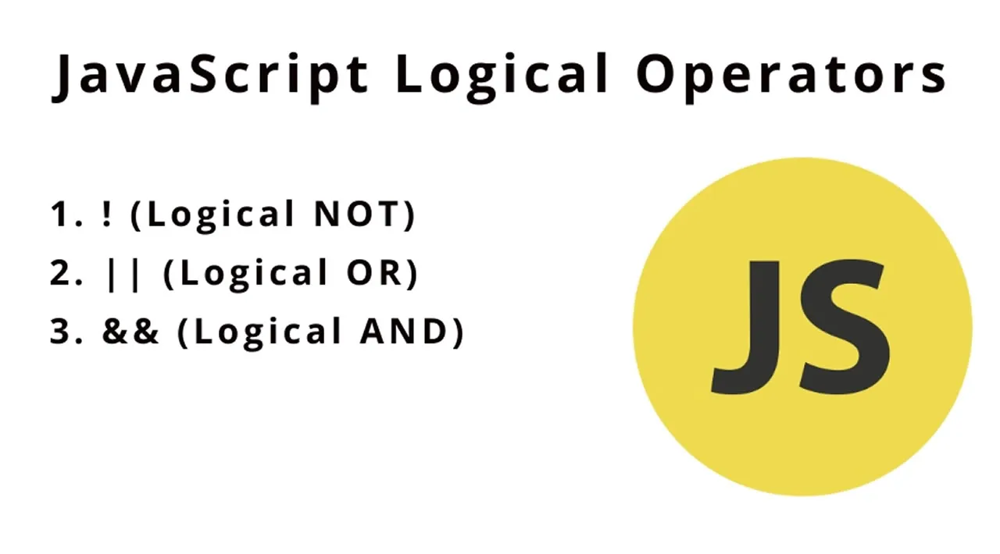

<hr>

### 15. **Dynamic elements**

- Dinamik elementlarni yaratish JavaScript-dan foydalangan holda DOM (Document Object Model) ga yangi HTML elementlarini qo'shish jarayonini anglatadi. Ushbu yondashuv ishlab chiquvchilarga ish vaqtida sahifa mazmunini yaratish va o'zgartirish uchun moslashuvchanlikni beradi, bu esa foydalanuvchi o'zaro ta'sirini va interfeysning sezgirligini oshiradi.

<hr>

### 16. **callstack and heap**


<hr>

### 17. **array  ?**

- JavaScript (JS) tilida massivlar (arrays) o'zgarmas, ko'p o'lchamli ma'lumotlarni boshqarish uchun foydalaniladi. Massivlar o'z ichiga bir nechta elementlarni saqlaydi va ularga indekslar orqali murojaat qilish mumkin. Massivlar "heap"da joylashadi va dinamik tarzda o'zgaruvchan yaratiladi. Quyidagi misol massiv yaratish va undan elementlarga murojaat qilishni namoyish etadi:

```
// Massiv yaratish
let fruits = ['Apple', 'Banana', 'Orange', 'Mango'];

// Massivdagi birinchi elementga murojaat qilish
let firstFruit = fruits[0];
console.log(firstFruit); // Natija: 'Apple'

// Massivdagi elementlarni o'zgartirish
fruits[1] = 'Grapes';

// Massivdagi barcha elementlarni chiqarish
for (let i = 0; i < fruits.length; i++) {
    console.log(fruits[i]);
}

```

-  Bu misolda, fruits nomli massiv yaratildi va undagi elementlarga indeks orqali murojaat qilindi. length xususiyati orqali massivning uzunligi aniqlanadi.

- JavaScript massivlari har qanday turdagi ma'lumotlarni o'z ichiga oladigan ko'p o'lchamli ma'lumotlardir. Massivlar ustida ko'p turli amallar bajarilishi mumkin, masalan, yangi element qo'shish, elementni o'chirish, massivni qo'shish, massivni kesish va boshqalar.

<hr>

### 18. **function ?**

- JavaScript (JS) tilidagi function so'zi funksiyalarni aniqlash va yaratish uchun ishlatiladi. Funksiya, delli bir vazifani bajarish uchun yozilgan JavaScript kod blokini ifodalaydi. Funksiya yaratilgandan so'ng, uni istalgan joyda chaqirish mumkin. function so'zi quyidagi ko'rinishda ishlatiladi:

```
function functionName(parameters) {
    // Funksiya ichidagi kod bloki
    // Bajariladigan vazifa
    return result; // Agar kerak bo'lsa, natija qaytariladi
}
```

- Bu yerda:

  -  functionName: Funksiya nomi. Uni chaqirishda ushbu nomdan foydalaniladi.
  -  parameters: Funksiyaga uzatiladigan o'zgaruvchilar (argumentlar) ro'yxati. Funksiyaga argument uzatilganda, ular funksiya ichidagi kod blokida ishlatiladi.
  -  return: Natijani qaytarish uchun ishlatiladi. Funksiya biror narsa qaytarsa, uni qo'lda qaytaradi.

<hr>

### 19. **array methods (simple) ?**

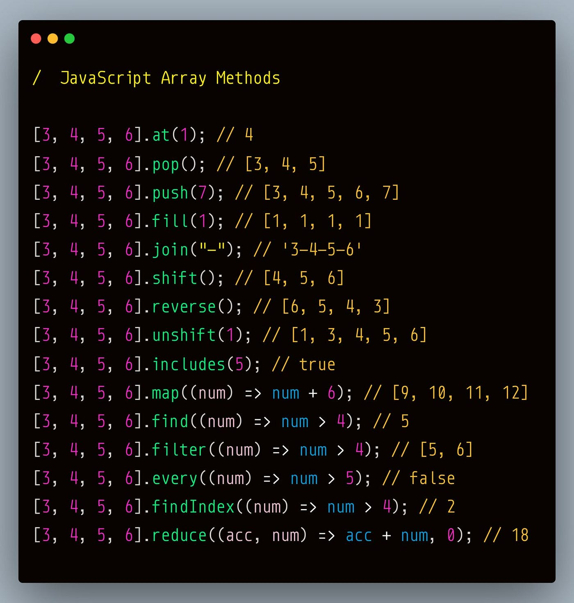

 - *Array -  bir vaqitning o'zida bir nechta qiymatlarni o'zida saqlashi mumkun bo'lgan obect. uni ikki hil ko'rinishda yaratishlik mumkun : 1- ko'rinishii va eng ko'p qo'lanadiga usul bu ( [ ] ) figurni qavuslar ichida yozishlik , 2- uslibi esa (new) kalit so'zidan foydalanib.* 

<p>M :</p>

```
// 1- misol

let arrayName = ['js' ,'java' , 'go'];

// 2- misol

let arrayName = new Array('js' ,'java' , 'go');

```

### Array'dan element olish
- Array - elementlarini uning indexslaridan foydalanib oloshligimiz mumkun . Array  elementlarining raqamlari ( 0 ) - dan boshlanadi.

<p>M :</p>

```
let arrayName = ['js' ,'java' , 'go'];
console.log(arrayName[0]); // natija ==> js
console.log(arrayName[2]); // natija ==> go
```
### Array'ga  element  qo'shish

-  Array'ga  element  qo'shish uchun " push() " va " ushift() " metodlaridan foydalanishligimiz mumkun . Bunda   " push() " - metodi bizga massivnig ohiridan element qo'shin=b bersa " ushift() " meto'di esa aksincha boshidan element qo'shinb beradi , yaqshiroq tushunishlik uchun misol koramiz. 

<p>M :</p>

```
// push() metodiga misol

let name =  ['js' ,'java'];
name.push('go');
console.log(name); //natija =>  ['js' ,'java' , 'go']

//unshift metodiga misol

let name =  ['java' , 'go'];
name.unshift('js');
console.log(name); //natija =>  ['js' ,'java' , 'go']

```

### Array elemeni ozgartirish

- Array elemeni ozgartirishlik uschun unig index'slaridan foydalansak bo'ladi.

<p>M :</p>

```
let name =  ['js' ,'java' , 'go' ];
console.log(name); //natija =>  ['js' ,'java' , 'go']
name[1]='c++';
console.log(name); //natija =>  ['js' ,'c++' , 'go']

```

### Array elementlarini o'chirish
- Array - elementlarini o'chirishlik uchun "pop( )" va "shift( )"metodlaridan foydalansak bo'ladi , bubda  "pop( )" - metodi massiv ichidagi ohirgi elamentni o'chiradi va o'chirilgan elamentni ham qaytarish imkoni mavjuv bu metodda , "shift( )"- metodi massiv ichidagi boshidagi elamentni o'chiradi va o'chirilgan elamentni ham qaytarish imkoni mavjuv bu metodda.

<p>M :</p>

```
// "pop()" metodi 

const name = ['js' , 'java' , 'go' , 'c++' , 'c#'];
const name2 = name.pop();
console.log(name); // natija => ['js' , 'java' , 'go' , 'c++' ]
console.log(name2); // natija => c#

//----------------------------------------------------------

//"shift()" metodi

const name = ['js' , 'java' , 'go' , 'c++' , 'c#'];
const name2 = name.shift();
console.log(name); // natija => [ 'java' , 'go' , 'c++' , 'c#' ]
console.log(name2); // natija => js
```

### Array uzunligini aniqlash

- Array uzunligini yani uning ichidagi conini aniqlashlik uchun ( lenght ) - hususiyatidan foydalanamiz .

<p>M :</p>

```
const name = ['js' , 'java' , 'go' , 'c++' , 'c#'];
console.log(name.lenght); // natiga ==> 5
```


### concat() Metod
- concat() -metodi ikki yoki undan ortiq arraylarni bitlashtiridshlik uchun ishlatiladi . bu ularni birlashtiradi va natiga qaytaradi .

<p>M :</p>

```
const array1 = [ 1, 4 ];
const array2 = [ 2, 3, 7 , 9 ];
const result = array1.concat(array2);
console.log(result); // natija ==> [1, 4, 2, 3, 7, 9]
```

### indexOf() va lastIndexOf() Metodlari:
- indexOf() belgilangan elementni birinchi marta qaysi indeksda ekanligini qaytaradi, lastIndexOf() esa oxirgi marta qaysi indeksda ekanligini.

<p>M :</p>

```
let fruits = ["apple", "banana", "kiwi", "melon", "banana"];
console.log(fruits.indexOf("banana")); // 1
console.log(fruits.lastIndexOf("banana")); // 4
```

### find() metodi

- find() - metodi birinchi bo'lib shart bajargan array elamentini qaytaradi , kopincha bu metod array ichida meto'd qaytarishlikda ishlatiladi.


<p>M :</p>

```
const result = [1, 4, 2, 3, 7, 9 ];
const findValue = (n) => n === 2 ;
const findValue2= result.find(findValue);
console.log(findValue2); // natiga  => 2 
// agar shartga tushmasa undefaind qaytaradi misol uchun n === 5 korinishini kiritsak.
```
### splice(start, deleteCount, item1, ..., itemN) Metodi:

- splice() metodi massivda belgilangan indeksdan boshlab ma'lum bir soni o'chiradi va/ya yangi element(lar)ni qo'shadi.

<p>M :</p>

```
let fruits = ["apple", "banana", "orange", "grape"];
fruits.splice(2, 1, "kiwi", "melon");
console.log(fruits); // natija ==>  ["apple", "banana", "kiwi", "melon", "grape"]

```
### slice(start, end) Metodi:
- slice() metodi massivning belgilangan oraliqni ko'chirib olish uchun ishlatiladi.


<p>M :</p>

```
let fruits = ["apple", "banana", "kiwi", "melon", "grape"];
let subArray = fruits.slice(1, 4);
console.log(subArray); //natija ==> ["banana", "kiwi", "melon"]

```
### indexOf() va lastIndexOf() Metodlari:
- indexOf() belgilangan elementni birinchi marta qaysi indeksda ekanligini qaytaradi, lastIndexOf() esa oxirgi marta qaysi indeksda ekanligini.


<p>M :</p>

```
let fruits = ["apple", "banana", "kiwi", "melon", "banana"];
console.log(fruits.indexOf("banana")); //natiga =>  1
console.log(fruits.lastIndexOf("banana")); //natiga =>  4

```

### includes() Metodi:

- includes() metodi massivda berilgan elementni qidiradi va mavjud bo'lsa true, aks holda false qaytaradi.

<p>M :</p>

```
let fruits = ["apple", "banana", "kiwi", "melon"];
console.log(fruits.includes("kiwi")); // true
console.log(fruits.includes("grape")); // false
```

<hr>


### 20. **pure , impure functons**

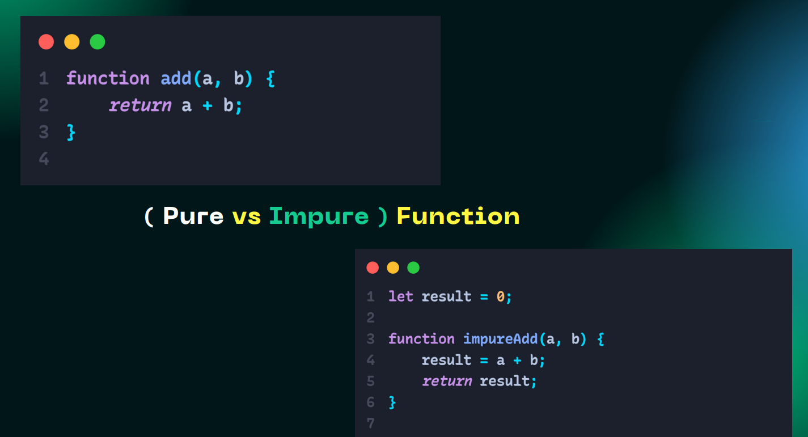

- **Pure function :** Tashqaridagi globol scoptegi hech narsaga tasir o'tqazmasa (mutatsiya qilmasa ozgaruvchilarni) bunday  funcsiya *Pure function* deb ataladi !

<p>M :</p>

```
function create(a, b) {
    return a + b;
}

create(11, 10);
```
- **Inpure function :**- Bu globol scoptegi narsalarga (o'zgaruvchilarga) ta'sir o'tkazsa , mutatsiya qilsa unda bunday funcsiya  *Inpure function*  deb ataladi.

<p>M :</p>

```
let arr = [];

function addElement(a) {
    arr.push(a);
    return arr;
}

addElement(21);
```

<hr>

### 21. **HOF -> higher orderd functions**

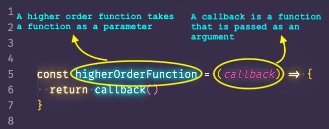

- **HOF -> Higher order functions -> Yuqori darajaklik funcsiya**
- *HOF* - funcsiya ichida funcsiya return qilinsa bunday funcsifa "HOF" funcsiya deb ataladi , yani bir funcsiyani ichida ikkinchi funcsiyani elon qilib uni o'sha birinchi funcsiyani ichida returin qilinisligiga aytiladi.
```
let a = "Hello World";

function closure() {
    // let a = "Goodbye World";

    console.log(a);

    function innerFunc() {
        let a = "GOOD";
        console.log(a);
    }
    innerFunc();
}

closure();
```
<hr>

### 22. **spread and rest operator ?**

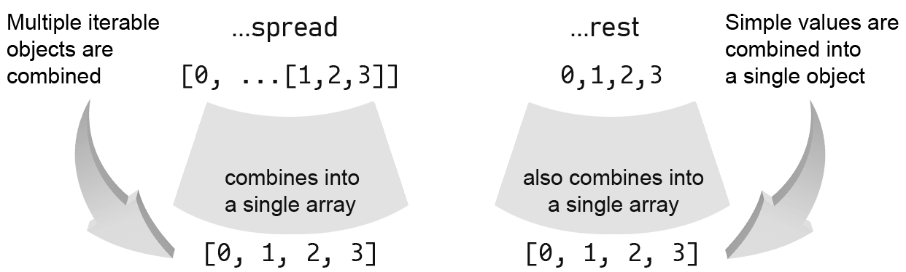

- **Spread Operator (...):**
Spread operator massivni yoki boshqa iteratsiya qiluvchi obyektlarni (iterable objects) o'z ichiga oladi va ularni ajratib olib, boshqa obyektga joylab yuboradi.

Massivlarda:

```
var arr1 = [1, 2, 3];
var arr2 = [...arr1, 4, 5];

// Natija: arr2 = [1, 2, 3, 4, 5], arr1 - o'zgarmaydi

```

Obyektlarda:

```
var obj1 = { a: 1, b: 2 };
var obj2 = { ...obj1, c: 3 };

// Natija: obj2 = { a: 1, b: 2, c: 3 }, obj1 - o'zgarmaydi

```

- **Rest Operator (...):**
Rest operator esa, funksiyalarda argumentlar ketma-ketligini (variadic) qabul qilish uchun ishlatiladi. U, argumentlar ro'yxatining qolgan qismini o'z ichiga oladi.

Funksiyalarda:

```
function sum(...numbers) {
  return numbers.reduce((acc, num) => acc + num, 0);
}

// Natija: sum(1, 2, 3, 4) = 10
```

 Rest operator yordamida funksiyaga berilgan argumentlar massivga aylanadi.

Bunday ko'rsatilgan misollar orqali, spread operator massivlarni yoki obyektlarni ajratib olib, rest operator esa funksiyalarda ko'p argumentlarni qabul qilish uchun ishlatiladi.

<hr>

### 23. **filter , map , forEach ?**

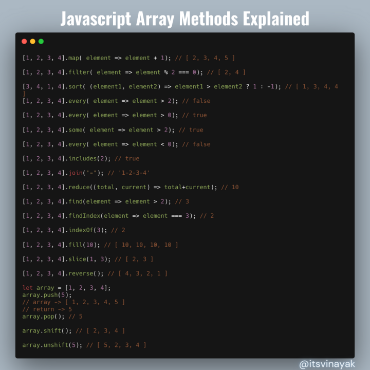;

- **filter()** metodi massivni filtratsiya qiladi va berilgan shartga mos keladigan barcha elementlarni yangi massivga joylaydi.

```
var numbers = [1, 2, 3, 4, 5, 6];

var evenNumbers = numbers.filter(function(number) {
  return number % 2 === 0;
});

// Natija: evenNumbers = [2, 4, 6], numbers - o'zgarmaydi
```


- **map()** metodi massivdagi har bir elementni belgilangan funktsiya bo'yicha qayta ishlaydi va yangi bir massiv yaratadi.

```
var numbers = [1, 2, 3, 4, 5];

var squaredNumbers = numbers.map(function(number) {
  return number * number;
});

// Natija: squaredNumbers = [1, 4, 9, 16, 25], numbers - o'zgarmaydi
```

- forEach() metodi massivdagi har bir elementni bir nechta qo'llanmalar uchun qayta ishlatadi.

```
var fruits = ['olma', 'banan', 'shaftoli'];

fruits.forEach(function(fruit) {
  console.log(fruit);
});

// Natija: console-da "olma", "banan", "shaftoli" chiqadi, fruits - o'zgarmaydi
```

- filter(), map(), va forEach() metodlari massivlarning har bir elementiga qo'llanma qilishda yordam beradi va kodni optimallashtirishga imkon beradi. Bu metodlar funksional dasturlash paradigmasiga mos keladigan, ochiqroq va oson kod yozishga imkoniyat yaratish uchun juda foydali bo'ladi.

<hr>

### 24. **reduce qanday ishlaydi ?**

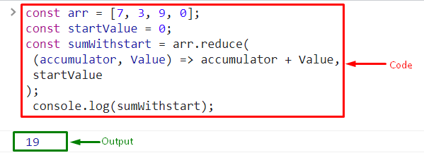

```
const sonlar = [1, 2, 3, 4, 5];

// Yig'indini hisoblash
const umumiy = sonlar.reduce((biriktiruvchi, joriyQiymat) => {
  return biriktiruvchi + joriyQiymat;
}, 0);

console.log(umumiy); // Natija: 15
```

- Bu misolda reduce funktsiyasi, ro'yxatdagi elementlarni qo'shish uchun ishlatilgan. Uning birinchi argumenti funksiya, ikkinchi argumenti esa boshlang'ich qiymat (0)dir.

Ushbu funktsiya, har bir turdagi qiymatlarni qo'shish, ko'paytirish yoki boshqa arifmetik amallarni bajarish uchun o'zgartirilishi mumkin. Ilova talablaringizga muvofiq sifatli funksiya yaratishingiz mumkin.

<hr>

### 25. **method nima  ?**

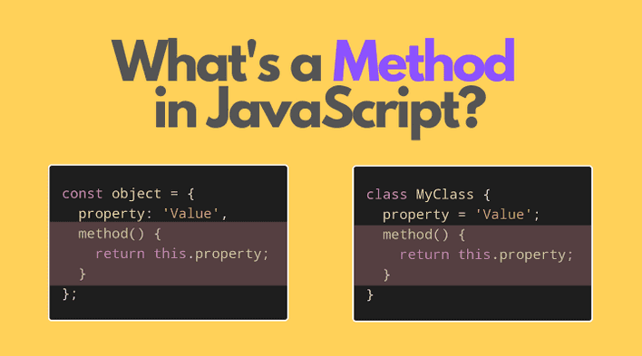

- js da hamma nara borib ohiri objectga taqaladi agar object ichida unig keyiga biz bironbir funcsiyani teglanb qoysak shu methodbo'ladi .

```
var myObject = {
  name: "John",
  age: 30,
  sayHello: function() {
    console.log("Salom, men " + this.name + ", " + this.age + " yoshdaman!");
  }
};

myObject.sayHello(); // "Salom, men John, 30 yoshdaman!"
```

### 26. **“use strict” keyword ?**

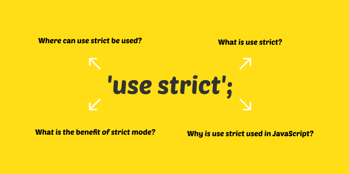

- "use strict" JavaScript dasturlash tilidagi xususiy bir qo'llanma (directive) bo'lib, u nazariy qoidalarga amal qilishni ta'minlaydi. Bu qo'llanma qo'shimcha xavfsizlik va kodni optimallashtirish uchun yozilgan kodni amal qilishda yordam beradi. Yani qisqa qilib aytganda js  oldingi versiyasidagi baglarni oldini oladi desak mubolaga bo'lmaydi.

<hr>

### 27. **".this" keyword**

- JavaScript dasturlash tilida this kalit so'zi obyektlarni yoki funksiyalarni ishlatgan joy va vaqtda ma'lumotlarga murojaat qilish uchun ishlatiladi. this so'zi o'z navbatida ma'lum bir kontekst yaratadi.

thisni o'rganish uchun ikki asosiy kontekst mavjud: obyekt va funksiya.

 1.  Obyekt Konteksti:
- Agar this bir obyektning ichida ishlatilsa, u o'sha obyektga murojaat qiladi.

```
var person = {
  name: "John",
  age: 30,
  sayHello: function() {
    console.log("Salom, men " + this.name + ", " + this.age + " yoshdaman!");
  }
};

person.sayHello(); // "Salom, men John, 30 yoshdaman!"
```
- sayHello funksiyasi ichida this obyektni bildiradi, shuning uchun this.name va this.age esa person obyekti ichidagi ma'lumotlarga murojaat qiladi.

 
JavaScript dasturlash tilida this kalit so'zi obyektlarni yoki funksiyalarni ishlatgan joy va vaqtda ma'lumotlarga murojaat qilish uchun ishlatiladi. this so'zi o'z navbatida ma'lum bir kontekst yaratadi.

thisni o'rganish uchun ikki asosiy kontekst mavjud: obyekt va funksiya.

1. Obyekt Konteksti:
Agar this bir obyektning ichida ishlatilsa, u o'sha obyektga murojaat qiladi.

```
javascript
Copy code
var person = {
  name: "John",
  age: 30,
  sayHello: function() {
    console.log("Salom, men " + this.name + ", " + this.age + " yoshdaman!");
  }
};
```

person.sayHello(); // "Salom, men John, 30 yoshdaman!"
sayHello funksiyasi ichida this obyektni bildiradi, shuning uchun this.name va this.age esa person obyekti ichidagi ma'lumotlarga murojaat qiladi.

2. Funksiya Konteksti:
- Agar this o'zgaruvchisi bir funksiya ichida ishlatilsa, u o'sha funksiya qayerda chaqirilsa, o'sha joyga murojaat qiladi.

```
function sayHello() {
  console.log("Salom, men " + this.name);
}

var person1 = {
  name: "John",
  speak: sayHello
};

var person2 = {
  name: "Alice",
  speak: sayHello
};

person1.speak(); // "Salom, men John"
person2.speak(); // "Salom, men Alice"
```
-  Bu misolda sayHello funksiyasi person1 va person2 obyektlari ichida speak xususiyatiga murojaat qiladi. Shu bilan birga, this.name sayHello funksiyasining chaqirildigi obyektning nomiga mos keladi.

<hr>

### 28 **deep copy , shalow copy**
Live Sass Compiler